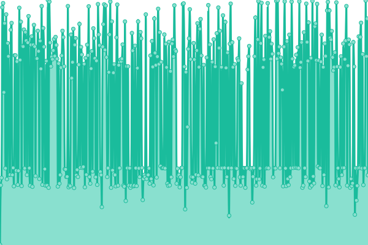
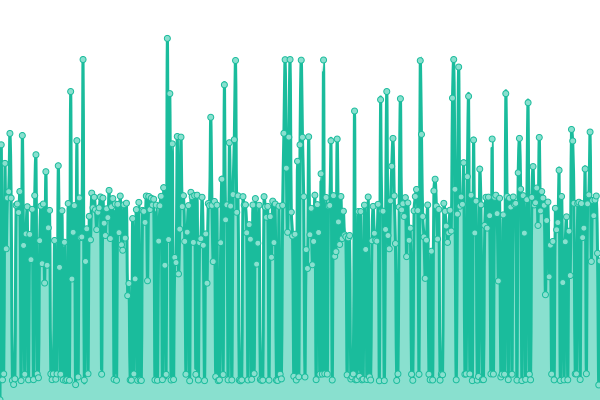

# [📈 Live Status](https://upptime.github.io/upptime): <!--live status--> **🟩 All systems operational**

This repository contains the open-source uptime monitor and status page for [Upptime](https://upptime.js.org), powered by [Upptime](https://github.com/upptime/upptime).

With [Upptime](https://upptime.js.org), you can get your own unlimited and free uptime monitor and status page, powered entirely by a GitHub repository. We use [Issues](https://github.com/upptime/upptime/issues) as incident reports, [Actions](https://github.com/DianaHaidarbaigi/LuisenGym/actions) as uptime monitors, and [Pages](https://upptime.github.io/upptime) for the status page.

<!--start: status pages-->
<!-- This summary is generated by Upptime (https://github.com/upptime/upptime) -->
<!-- Do not edit this manually, your changes will be overwritten -->
<!-- prettier-ignore -->
| URL | Status | History | Response Time | Uptime |
| --- | ------ | ------- | ------------- | ------ |
|  [Luinet](https://luinet.de) | 🟩 Up | [luinet.yml](https://github.com/DianaHaidarbaigi/LuisenGym/commits/HEAD/history/luinet.yml) | 

 653ms
     
 | 

<a href="https://DianaHaidarbaigi.github.io/LuisenGym/history/luinet">100.00%</a>
    

|  [Halloluise](https://halloluise.de) | 🟩 Up | [halloluise.yml](https://github.com/DianaHaidarbaigi/LuisenGym/commits/HEAD/history/halloluise.yml) | 

 533ms
     
 | 

<a href="https://DianaHaidarbaigi.github.io/LuisenGym/history/halloluise">100.00%</a>
    

|  [eduPort Lui](https://luise.hamburg.de) | 🟩 Up | [edu-port-lui.yml](https://github.com/DianaHaidarbaigi/LuisenGym/commits/HEAD/history/edu-port-lui.yml) | 

 1422ms
     
 | 

<a href="https://DianaHaidarbaigi.github.io/LuisenGym/history/edu-port-lui">99.67%</a>
    

|  [LMS Hamburg](https://lms.lernen.hamburg) | 🟩 Up | [lms-hamburg.yml](https://github.com/DianaHaidarbaigi/LuisenGym/commits/HEAD/history/lms-hamburg.yml) | 

 853ms
     
 | 

<a href="https://DianaHaidarbaigi.github.io/LuisenGym/history/lms-hamburg">100.00%</a>
    

|  [Divis](https://login-divis.hamburg.de/logon/LogonPoint/tmindex.html) | 🟩 Up | [divis.yml](https://github.com/DianaHaidarbaigi/LuisenGym/commits/HEAD/history/divis.yml) | 

 1153ms
     
 | 

<a href="https://DianaHaidarbaigi.github.io/LuisenGym/history/divis">100.00%</a>
    

<!--end: status pages-->

[**Visit our status website →**](https://upptime.github.io/upptime)

## 📄 License

- Powered by: [Upptime](https://github.com/upptime/upptime)
- Code: [MIT](./LICENSE) © [Upptime](https://upptime.js.org)
- Data in the `./history` directory: [Open Database License](https://opendatacommons.org/licenses/odbl/1-0/)
